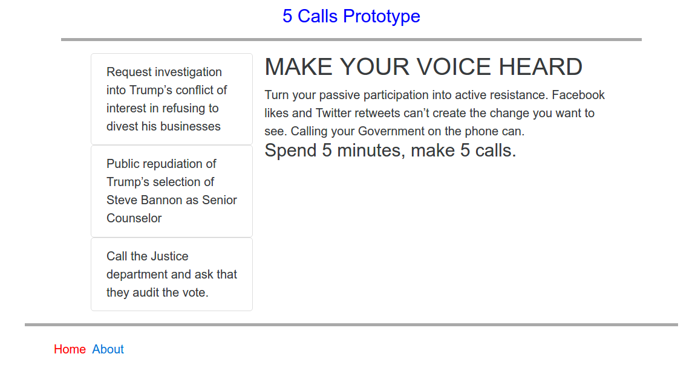
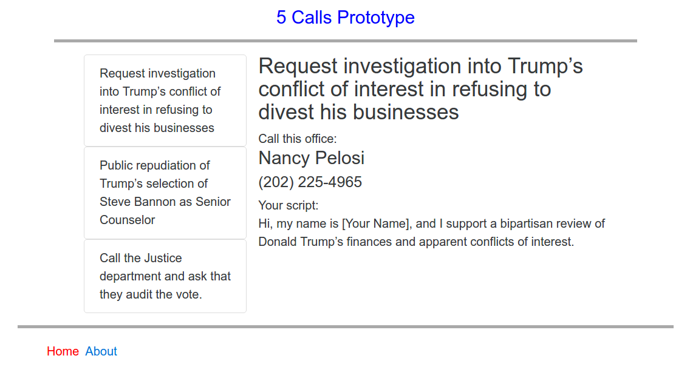
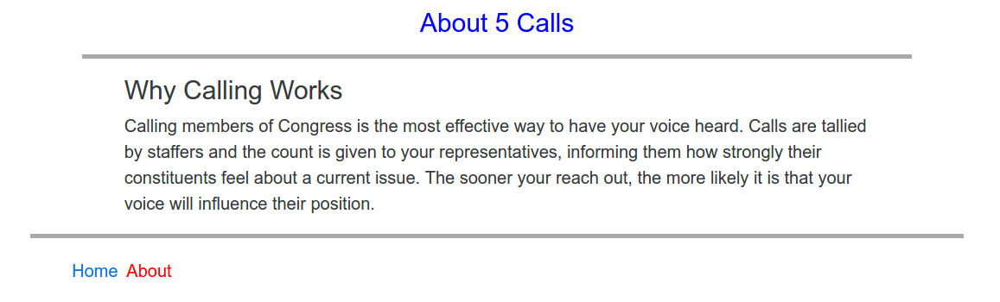

# 5calls-ts-react-redux
This repo is a proof-of-concept showing how the 5 Calls website could be developed
using the React UI framework, the Redux state management library
and TypeScript for type-safe JavaScript development.

The code here is not intended to replicate the design of 5 Calls and all of
its functionality; it is just a technology demonstration.

## Screenshots

### Home Page


### Issue Page


### About Page



## Building and running the code

Installation (will also install the type definitions for React and Redux):
```
npm install
```

- Running the development server :
```
npm start
```
